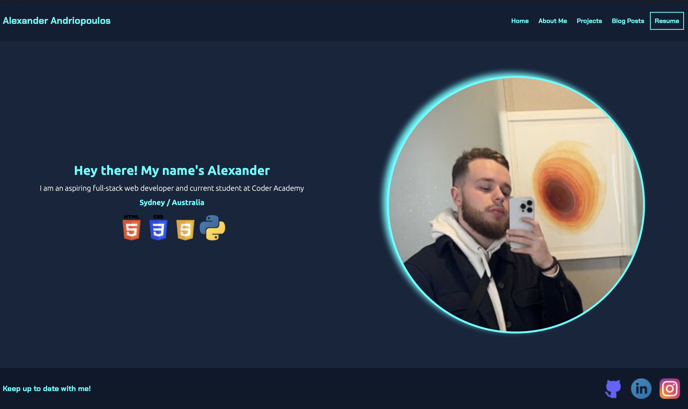

# T1A2 - PORTFOLIO - ALEXANDER ANDRIOPOULOS

[Link to Github Repository](https://github.com/Andrios17/t1a2Portfolio)

## Description

This portfolio was completed as an assessment item as part of the Higher Education Diploma offered by Coder Academy. All material learnt throughout weeks 1 and 2 of the diploma have been utilised to complete this project. The tech stack used for this project includes both **HTML5 and CSS**. I completed this assignment with the mindset of a seasoned web developer who is aiming to utilise this portfolio to reach perspective employers in the industry with the hopes of gaining employment as a full-stack web developer in a small to medium software development company.

**This project features  a total of nine HTML documents that all link together and which have all been designed with a mobile first design to provide a seemless user experience.** It is simple in its design, and this is done with the purpose of creating a portfolio that focuses on providing key information to perspective employers in a way that does not take away from the information that is being conveyed.

## Sightmap of the portfolio


### General Navigation around the portfolio

As seen in the above sightmap of the portfolio, the portfolios navigation is quite simple, with all pages linkning together and key pieces of information only being mere clicks away for any users. In the main navigation bar (which is constantly fixed on the page and follows the user throughout their experience by implementing ```display: sticky;```) the key pages which of are particular interest to any perspective employers are located. These pages include the home page, about me page, projects page and blog posts page. This is done in an effort to make navigation around the portfolio simple and time efficient, minimising the number of inputs users need to complete to find what they are interested in.


### Navigation around the blog posts pages

Following on from this, there are five child pages of the blog post page which each display a blog sample required by the assessment criteria. On top of the previous mentioned main navigation bar throughout the portfolio, a similar bar will display when the user is within one of these blog sample pages. Again, this was completed with ease of user experience in mind to again mitigate the number of inputs required by the user to make their way around the portfolio. The names of the blog sample pages were opted to fill out this navigation bar as, in my mind, the titles of these interesting were more likely to draw in perspective readers as opposed to solely using date stamps.

However, unlike the main navigation bar, I opted to remove this navigation bar for mobile users as it seemed to both takeway from precious screen realestate and it was extremely awkward to inplement.


## Design Choices and Wireframes of the portfolio

### Aesthic of the portfolio

The aesthic of the portfolio is simple, there are no crazy animations that make images fly in or coloages of images. Everything is displayed where it should be while utilising a futuristic colour pallete that allows key information to easily grab the attention of readers.

The combination of dark blue backgrounds for components with bright aqua for key headings, in my mind, achieves this aesthic. The choice of providing shadow border backgrounds for all images adds to that futristic feel of the portfolio. An example of this can be seen in the image below which is a screenshot from the projects page of the portfolio.


### Wireframes and design process/choices

In total, there were 15 different wireframes which were created to accruately plan the design of the portfolio. **These 15 wireframes include 3 wireframes for each individual html page (one for mobile design, one for tablet design, and one for desktop designs).**

In an effort to avoid cluttering this document, I have decided to include a sample of 3 wireframes that were created for the **About Me** page, as this is the page that conveys the most amount of information within the portfolio and its design amongst the three different viewports differs the most.

#### Mobile Design


#### Tablet Design


#### Desktop Design


**All of the created wireframes can be found within the images folder of the project**

As seen in the ***About Me*** wireframes, it was always the goal to create this portfolio with a simplistic design and while utilising CSS flexbox heavily. This was done in an effort not only nail down the basics learnt throughout the beginning stages of the diploma, but also to make the portfolio easy not only for perspective employers to navigate but also any potential users that may come across this piece of work. The heavy reliance on flexbox is quite prevenlent throughout the portfolio. When viewing the source code of the portfolio, most if not all the components included to make up the portfolio are wrapped in a container which utilising ```display: flexbox;```.

In terms of the design for mobile users, a barebones approach was utilised. This was to ensure that amount of scrolls utilised to by users to view all relevent information was minimal but also to ensure that the minimal screen realestate was used to convey information that was of outmost importance. This came at the sacrafice of various images that are present in both the tablet and desktop designs but not in the mobile designs.

The tablet and desktop implementations are quite similar in scope as utiising a combination of flexbox and relative measurement units, allowed components to be scaled acurately depening on the screen size of the device being used to view the portfolio.

### Difficulty of implementing these wireframes to the finished product

All in all, the implementation of the designed wireframes to the final product of the porfolio was quite smooth. The biggest challenge was finding the right width to implement ***media break points*** to ensure the final product was responsive for users utilising different devices.

The acruracy of the final portfolio when compared to the wireframe mock-ups can be seen in the images below which depict the final product of the **About Me page (particulary my journey to web development components) for all device types**. **In total, there are 8 media breakpoints included in the final code of the portfolio.**

#### Mobile


#### Tablet


#### Desktop


## Components used throughout the portfolio

In order to complete a well-rounded portfolio, many components were created with the aim of displaying vital information and providing seemless user experience. As you will see below, many components were reused across the portfolio in an effort to achieve ease of user experience.

However, all there are no wasted components. Everything created served a purpose of engaging users and werent placed in pages where the theme of that page did not match the aim of the component.

### Reused Commponents

**These components were reused across multiple pages of the portfolio.**

* **Navbar** - Designed to provide for easy navigation around the portfolio. **Also includes a resume link which will automatically download a copy of my resume to the users downloads folder on their device for ease of access.** 
* **Blog Post Navbar** - Designed to provide for easy navigation around the sample blog posts which are child pages of the blogPost.html page in the hopes of engaging the user to read further blog posts without them having click back to blog posts page. One click is more likely to capitivate users to continue rather than having to complete two clicks. 
* **Contact Me** - Provided easy access to information which would be useful to contact me if any potential employers were interested in doing so. Includes both a phone number and email which I can be contacted on.
* **Footer** - A footer which allows for easy access to social media outlets which serve a profesional purpose and appropriate for the target auience including; Github, LinkedIn and Instagram.


### Home Page Components

* **Hero Container** - Allowed for an introductory statement about myself as well as an image of myself. Responsive depending on the screenwidth of the user.

### About Me Page Components

* **Hero Container** - Allowed for an introductory statement regarding the page as well as an image of myself, engagement with audience as it fits the overall aesthic of the page created. 
* **My Skills** - Utilised to display information regarding any hard-skills, learnt throughout my time at Coder Academy and in my own time  skills  are of relevence to full-stack web development. Also utilised to display any soft-skills which may be of relevence. It's simplicity is leaned upon as it is a short snapshot of my skills 
* **My Interests** - Utilised to display information regarding my interests so any perpective employer can connect with me on a personal level. Created to display how I would fit culturally in any work environment. Simple in its design, however, its simplicity will allow for ease of access to users to gain a better understanding of who I am as a person. 
* **My Journey Container** - Created to display what has lead me to pursue a career in web development and my past experiences in the workforce. Again, working on the previosly used components, will allow any perspective employer who views this portfolio to build a wholistic picture of who I am as a person and what I hope to achieve in this industry. Smaller screens will not display images, however, users utilising tablets or desktops will see images that correspond to each stage of my journey. 

### Projects Page Components

* **Projects** - Integrated to display the projects I have completed throughout my time at Coder Academy. Utilises a flexbox display and is responsive depending on screen size. Will begin in a coloumn flexbox display on mobile and shift to a row display on tablet and desktop devices. This is completed in an effort to avoid using unused screen real estate and be easier for users on bigger screens to view all important information and be engaged with.

### Blog Post Components

* **Blog List** - This component displays a list of links which take the user to the corresponding sample post. There are five in total and are labelled in with both the blog title and date published. On smaller screens, images will fill the background of each of the links containers. On larger screens, these background images will no longer appear and instead be located adjacent to the blog links container. This has been created utilising nested ```<div>``` tags within the ```<HTML>``` page. The use of images along with the links in this style will engage the user to be intrigued about the contents of the blog post and hopefully be motivated to read further. 

### Sample Blog Post Components

* **Published Blog Components** - A component to hold both an image relevent to and published blog material. Lorem text has been utilised as placeholder text. Styling is again simple however, display all necessary information to engage the user.

## Screenshots of Final Portfolio

### Home Page



### About Me Page


### Projects Page


### Blog Posts Page


### Published Sample Blog Page


